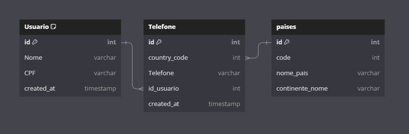

# Crud Laravel com Frontend em React - React, Laravel, MySQL, Docker
Just a basic boilerplate to start directly coding on React, Laravel, MySQL and Docker Compose.

## Frontend
- NodeJS 20.9.0 Alpine
- React 18.2.0
- eslint 8.53

## Backend
- PHP 8.2 FPM
- Laravel 10
- Composer 2.5.8

## MySQL and Docker

- MySQL Version: 8.2
- Docker Version: 24.0.7
- Docker Compose Version: 2.21.0

## Using the Project

Execute the following command and the Docker will build and run the containers;

```
docker-compose up -d --build
```

To read from the database, it is necessary for the backend to have a ``.env`` file in its folder.

### Diagram do DB

For more details, click on the image.   
[](https://dbdiagram.io/d/CIA-SImples-65727a8656d8064ca09e7e36)